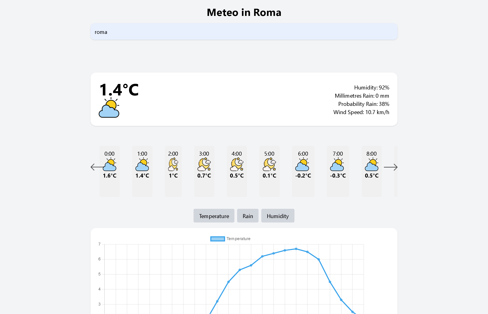

# Open Web Meteo
## Web application for displaying daily weather forecasts and current weather conditions. Data is fetched from the open-meteo API.

## Functionalities
- **Search Bar:** Search bar for city search, only cities can be searched, not countries or regions

- **Current weather and 24-hour weather forecasts**

- **Temperature, rain and humidity trend graphs**

## Technologies
- **Frontend:** html,CSS,tailwind CSS, Javascript

- **API:** open-meteo API

## Repo Structure
```
weather_app
├─ css
│  ├─ input.css
│  ├─ style.css
│  └─ tailwind-output.css
├─ icons
│  ├─ cloudy.png
│  ├─ cloudy_sunny_rain.png
│  ├─ drizzle-night.png
│  ├─ drizzle.png
│  ├─ fog.png
│  ├─ heavy_rain.png
│  ├─ heavy_rain_moon.png
│  ├─ left-arrow.png
│  ├─ moon_clear.png
│  ├─ moon_cloudy.png
│  ├─ moon_fog.png
│  ├─ right-arrow.png
│  ├─ snow.png
│  ├─ snow_moon.png
│  ├─ storm.png
│  ├─ sun.png
│  ├─ thunderstorm.png
│  └─ thunderstorm_moon.png
├─ img
├─ index.html
├─ js
│  ├─ api.js
│  ├─ chart.js
│  ├─ script.js
│  └─ ui.js
├─ README.md
└─ tailwindcss-windows-x64.exe

```

## Preview
